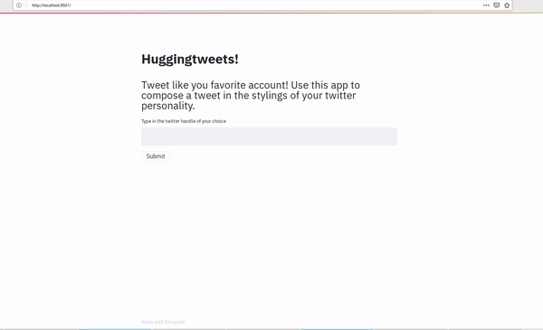

# HuggingTweets - Train a model to generate tweets

I modified Boris Dayma's original huggingtweets repo and played around with building an app using the awesome [Streamlit](https://www.streamlit.io/) tool. See the screencast below to see what the app can do. It is a work in progress - I will hopefully deploy it as a website at some point.

## Streamlit based Huggingtweets app demo

## Acknowledgements

Credit goes to [Boris Dayma](https://github.com/borisdayma) for the original repo that this was forked from. 

It would not have been possible without these people and these open-source tools:

* [W&B](http://docs.wandb.com/) for the great tracking & visualization tools for ML experiments ;
* [Huggingface](https://huggingface.co/) for providing a great framework for Natural Language Understanding ;
* [Tweepy](https://www.tweepy.org/) for providing a great API to interact with Twitter (used in the dev notebook) ;
* [Chris Van Pelt](https://github.com/vanpelt) for hacking with me on the demo ;
* [Lavanya Shukla](https://github.com/lavanyashukla) for her great continuous feedback on the demo ;
* [Google Colab](https://colab.research.google.com/) for letting people access free GPU!
